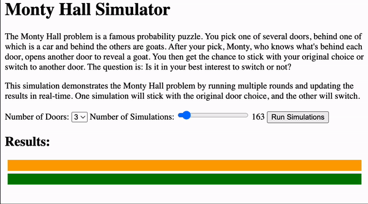
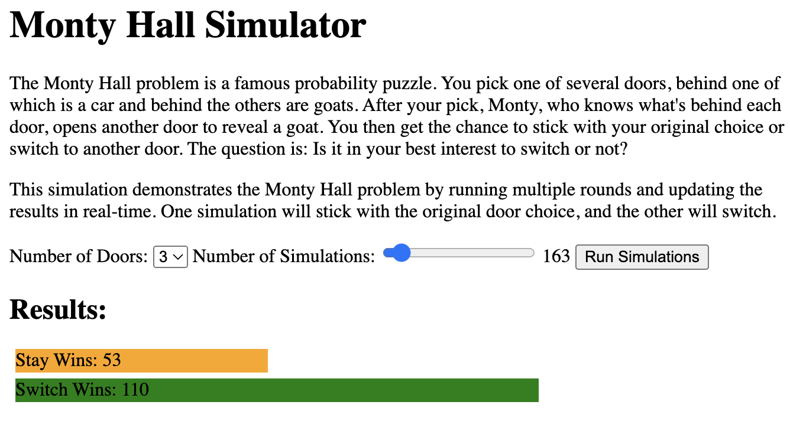
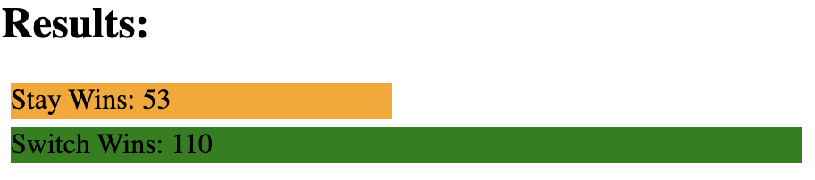

# Monty-Hall-problem-JS

# Monty Hall Simulator



The Monty Hall Simulator is a web-based application to visualize the results of the Monty Hall problem - a famous probability puzzle. Through a series of simulations, users can understand the implications of sticking with their original choice or switching after Monty reveals a goat behind one of the other doors.

## Features

- **Configurable Door Count**: Choose from 3 up to 9 doors.
- **Simulation Slider**: Run between 100 to 1000 simulations to get an extensive understanding of the outcomes.
- **Real-time Results**: Witness the results in real-time with each simulation showing the outcome for sticking versus switching.



## Getting Started

1. Clone the repository:
    ```bash
    git clone https://github.com/YOUR_USERNAME/MontyHallSimulator.git
    ```

2. Navigate to the directory and open `index.html` in your preferred browser.

3. Set the desired number of doors, adjust the number of simulations using the slider, and click on "Run Simulations".

4. Observe the results and analyze the benefits of sticking or switching!

## Understanding the Monty Hall Problem

The Monty Hall problem is based on a game show scenario where a contestant has to choose one of several doors. Behind one door is a car, and behind the others are goats. Once the contestant makes an initial choice, Monty (the host), who knows what's behind each door, opens another door to reveal a goat. The contestant then gets the choice to stick with their original choice or switch to another door.

This simulation aims to demonstrate the probabilities of winning if the contestant sticks with their initial choice or decides to switch.



## Contributing

Feel free to fork this repository, make your changes, and submit a pull request. We're open to any enhancements or improvements.

## License

This project is licensed under the MIT License. See `LICENSE` for more details.
